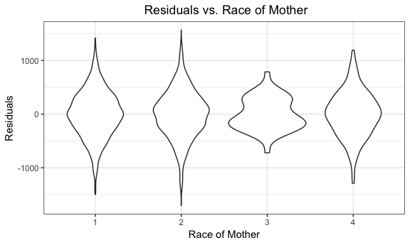
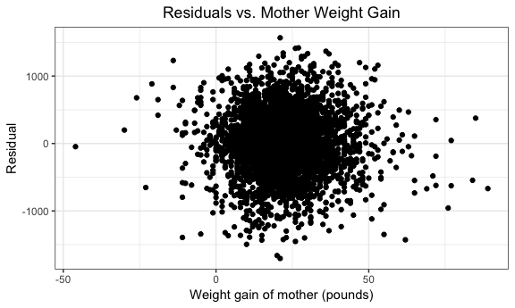

hwk6\_aar2192
================
Amadeia Rector
11/20/2018

Problem 1
=========

This problem uses the dataset on homicides given by the Washington Post.

### Part a

Create a city\_state variable (e.g. “Baltimore, MD”), and a binary variable indicating whether the homicide is solved. Omit cities Dallas, TX; Phoenix, AZ; and Kansas City, MO – these don’t report victim race. Also omit Tulsa, AL – this is a data entry mistake. Modifiy victim\_race to have categories white and non-white, with white as the reference category. Be sure that victim\_age is numeric.

``` r
homicide_df = 
  read_csv("data/homicide-data.csv", na = c("", "NA", "Unknown")) %>%
  mutate(
    city_state = str_c(city, state, sep = ", "),
    resolution = case_when(
      disposition == "Closed without arrest" ~ "unresolved",
      disposition == "Open/No arrest"        ~ "unresolved",
      disposition == "Closed by arrest"      ~ "resolved"
    )
  ) %>% 
  filter(city_state != "Tulsa, AL") %>% 
  filter(city_state != "Dallas, TX") %>% 
  filter(city_state != "Phoenix, AZ") %>% 
  filter(city_state != "Kansas City, MO") %>% 
  filter(victim_race != is.na(victim_race)) %>% 
  mutate(victim_race = ifelse(victim_race %in% "White", "white", "non-white"),
         victim_race = fct_relevel(victim_race, "white"),
         victim_age = as.numeric(victim_age))
## Parsed with column specification:
## cols(
##   uid = col_character(),
##   reported_date = col_integer(),
##   victim_last = col_character(),
##   victim_first = col_character(),
##   victim_race = col_character(),
##   victim_age = col_integer(),
##   victim_sex = col_character(),
##   city = col_character(),
##   state = col_character(),
##   lat = col_double(),
##   lon = col_double(),
##   disposition = col_character()
## )
```

I cleaned the dataset given fromthe Washington post. Age was converted to a numerical variable, race was made into a binary variable, and observations with missing data from race were deleted. Additionally, four cities were deleted from the dataset due to missing information/incorrect coding.

### Part b

For the city of Baltimore, MD, use the glm function to fit a logistic regression with resolved vs unresolved as the outcome and victim age, sex and race (as just defined) as predictors. Save the output of glm as an R object; apply the broom::tidy to this object; and obtain the estimate and confidence interval of the adjusted odds ratio for solving homicides comparing non-white victims to white victims keeping all other variables fixed.

``` r
fit_logistic_balt =
  homicide_df %>% 
  mutate(resolved = as.numeric(resolution == "resolved")) %>% 
  filter(city == "Baltimore") %>% 
  glm(resolved ~ victim_age + victim_race + victim_sex, data = ., family = binomial())

fit_logistic_balt %>% 
  broom::tidy() %>% 
  mutate(CI_lower = estimate - 1.96*std.error,
         CI_upper = estimate + 1.96*std.error,
         OR = exp(estimate),
         CI_lower = exp(CI_lower),
         CI_upper = exp(CI_upper)) %>%
  select(term, log_OR = estimate, OR, CI_lower, CI_upper, p.value) %>% 
  filter(term=="victim_racenon-white") %>% 
  select(term, OR, CI_lower, CI_upper) %>% 
  knitr::kable(digits = 3)
```

| term                  |     OR|  CI\_lower|  CI\_upper|
|:----------------------|------:|----------:|----------:|
| victim\_racenon-white |  0.441|      0.313|       0.62|

The data was filtered to just look at Baltimore cases. A logistic regression was conducted to investigate the association between race and resolved cases controlling for age and sex of the victim.

The estimated adjusted OR for solving homicides comparing non-white victims to white victims keeping all other variables fixed is 0.441 with a 95% confidence interval of 0.313 to 0.620. Non-white victims have 0.441 times the likelihood of having a resolved case compared to white victims in Baltimore. We are 95% confident that the true OR lies between 0.313 to 0.620, adjusting for sex and age.

### Part c

Now run glm for each of the cities in your dataset, and extract the adjusted odds ratio (and CI) for solving homicides comparing non-white victims to white victims. Do this within a “tidy” pipeline, making use of purrr::map, list columns, and unnest as necessary to create a dataframe with estimated ORs and CIs for each city.

``` r
  homicide_df %>% 
  mutate(resolved = as.numeric(resolution == "resolved")) %>% 
  group_by(city_state) %>% 
  nest() %>% 
  mutate(models = map(data, ~glm(resolved ~ victim_age + victim_race + victim_sex, data = ., family = binomial())),
         models = map(models, broom:::tidy)) %>% 
  select(-data) %>% 
  unnest() %>% 
  filter(term=="victim_racenon-white") %>% 
  mutate(CI_lower = estimate - 1.96*std.error,
         CI_upper = estimate + 1.96*std.error,
         OR = exp(estimate),
         CI_lower = exp(CI_lower),
         CI_upper = exp(CI_upper)) %>%
  select(city_state, OR, CI_lower, CI_upper) %>% 
  knitr::kable(digits = 3)
```

| city\_state        |     OR|  CI\_lower|  CI\_upper|
|:-------------------|------:|----------:|----------:|
| Albuquerque, NM    |  0.739|      0.447|      1.223|
| Atlanta, GA        |  0.753|      0.432|      1.313|
| Baltimore, MD      |  0.441|      0.313|      0.620|
| Baton Rouge, LA    |  0.668|      0.313|      1.425|
| Birmingham, AL     |  1.039|      0.615|      1.756|
| Boston, MA         |  0.127|      0.052|      0.307|
| Buffalo, NY        |  0.392|      0.214|      0.719|
| Charlotte, NC      |  0.558|      0.321|      0.969|
| Chicago, IL        |  0.562|      0.431|      0.733|
| Cincinnati, OH     |  0.318|      0.184|      0.551|
| Columbus, OH       |  0.861|      0.638|      1.161|
| Denver, CO         |  0.602|      0.359|      1.009|
| Detroit, MI        |  0.652|      0.488|      0.870|
| Durham, NC         |  1.003|      0.404|      2.489|
| Fort Worth, TX     |  0.838|      0.555|      1.266|
| Fresno, CA         |  0.445|      0.229|      0.864|
| Houston, TX        |  0.873|      0.699|      1.090|
| Indianapolis, IN   |  0.505|      0.382|      0.667|
| Jacksonville, FL   |  0.658|      0.502|      0.862|
| Las Vegas, NV      |  0.763|      0.592|      0.982|
| Long Beach, CA     |  0.794|      0.388|      1.626|
| Los Angeles, CA    |  0.666|      0.483|      0.918|
| Louisville, KY     |  0.392|      0.259|      0.593|
| Memphis, TN        |  0.778|      0.521|      1.162|
| Miami, FL          |  0.577|      0.376|      0.885|
| Milwaukee, wI      |  0.632|      0.403|      0.991|
| Minneapolis, MN    |  0.646|      0.345|      1.209|
| Nashville, TN      |  0.902|      0.656|      1.241|
| New Orleans, LA    |  0.467|      0.295|      0.738|
| New York, NY       |  0.532|      0.279|      1.012|
| Oakland, CA        |  0.213|      0.104|      0.435|
| Oklahoma City, OK  |  0.681|      0.478|      0.971|
| Omaha, NE          |  0.170|      0.094|      0.307|
| Philadelphia, PA   |  0.644|      0.486|      0.852|
| Pittsburgh, PA     |  0.282|      0.161|      0.493|
| Richmond, VA       |  0.447|      0.162|      1.238|
| San Antonio, TX    |  0.689|      0.461|      1.030|
| Sacramento, CA     |  0.781|      0.449|      1.359|
| Savannah, GA       |  0.605|      0.284|      1.288|
| San Bernardino, CA |  0.880|      0.393|      1.972|
| San Diego, CA      |  0.483|      0.298|      0.785|
| San Francisco, CA  |  0.458|      0.290|      0.723|
| St. Louis, MO      |  0.577|      0.406|      0.820|
| Stockton, CA       |  0.376|      0.196|      0.719|
| Tampa, FL          |  1.159|      0.587|      2.288|
| Tulsa, OK          |  0.596|      0.408|      0.869|
| Washington, DC     |  0.514|      0.260|      1.017|

Using the function glm, I conducted logistic regression for all of the cities through use of map statements and list columns. I extracted only the estimated adjusted ORs and their 95% confidence intervals.

### Part d

Create a plot that shows the estimated ORs and CIs for each city. Organize cities according to estimated OR, and comment on the plot.

``` r
homicide_cities_OR = 
  homicide_df %>% 
  mutate(resolved = as.numeric(resolution == "resolved")) %>% 
  group_by(city_state) %>% 
  nest() %>% 
  mutate(models = map(data, ~glm(resolved ~ victim_age + victim_race + victim_sex, data = ., family = binomial())),
         models = map(models, broom:::tidy)) %>% 
  select(-data) %>% 
  unnest() %>% 
  filter(term=="victim_racenon-white") %>% 
  mutate(CI_lower = estimate - 1.96*std.error,
         CI_upper = estimate + 1.96*std.error,
         OR = exp(estimate),
         CI_lower = exp(CI_lower),
         CI_upper = exp(CI_upper)) %>%
  select(city_state, OR, CI_lower, CI_upper)

homicide_cities_OR %>% 
  mutate(city_state = fct_reorder(city_state, OR)) %>% 
  ggplot(aes(x = city_state, y = OR)) +
  geom_point() +
  geom_errorbar(aes(ymin = CI_lower, ymax = CI_upper)) +
  labs(x = "Cities", y = "Estimated Adjusted OR", title = "OR for Resolved Murders Comparing Non-white to White Race") +
  theme(axis.text.x = element_text(angle = 90, hjust = 1))
```


The city with the lowest estimated OR is Boston, MA followed by Omaha, NE and Oakland, CA. The 95% Confidence Interval is narrow for these cities as well. A low estimated OR here means that the number of resolved cases where the victim is non-white is less than that of white victims, adjusting for age and sex. There is a higher OR for the cities Tampa, FL, Birmingham, AL, and Durham, NC. However, The confidence interval for these cities is very wide. These three cities are the only ones with an estimated adjusted OR higher than 1. This goes to show that there is a stark disparity with regard to how race factors into the resolution of a murder across all cities.

Problem 2
=========

In this problem, I will analyze data gathered to understand the effects of several variables on a child’s birthweight.

### Part a

Load and clean the data for regression analysis (i.e. convert numeric to factor where appropriate, check for missing data, etc.).

``` r
birthweight_df =
  read_csv("data/birthweight.csv", na = c("", "NA", "Unknown")) %>% 
  janitor::clean_names() %>% 
  mutate(babysex = as.factor(babysex),
         frace = as.factor(frace),
         malform = as.factor(malform),
         mrace = as.factor(mrace)) %>% 
  filter(frace != 9) 
## Parsed with column specification:
## cols(
##   .default = col_integer(),
##   gaweeks = col_double(),
##   ppbmi = col_double(),
##   smoken = col_double()
## )
## See spec(...) for full column specifications.

birthweight_df%>% 
  str()
## Classes 'tbl_df', 'tbl' and 'data.frame':    4342 obs. of  20 variables:
##  $ babysex : Factor w/ 2 levels "1","2": 2 1 2 1 2 1 2 2 1 1 ...
##  $ bhead   : int  34 34 36 34 34 33 33 33 36 33 ...
##  $ blength : int  51 48 50 52 52 52 46 49 52 50 ...
##  $ bwt     : int  3629 3062 3345 3062 3374 3374 2523 2778 3515 3459 ...
##  $ delwt   : int  177 156 148 157 156 129 126 140 146 169 ...
##  $ fincome : int  35 65 85 55 5 55 96 5 85 75 ...
##  $ frace   : Factor w/ 5 levels "1","2","3","4",..: 1 2 1 1 1 1 2 1 1 2 ...
##  $ gaweeks : num  39.9 25.9 39.9 40 41.6 ...
##  $ malform : Factor w/ 2 levels "0","1": 1 1 1 1 1 1 1 1 1 1 ...
##  $ menarche: int  13 14 12 14 13 12 14 12 11 12 ...
##  $ mheight : int  63 65 64 64 66 66 72 62 61 64 ...
##  $ momage  : int  36 25 29 18 20 23 29 19 13 19 ...
##  $ mrace   : Factor w/ 4 levels "1","2","3","4": 1 2 1 1 1 1 2 1 1 2 ...
##  $ parity  : int  3 0 0 0 0 0 0 0 0 0 ...
##  $ pnumlbw : int  0 0 0 0 0 0 0 0 0 0 ...
##  $ pnumsga : int  0 0 0 0 0 0 0 0 0 0 ...
##  $ ppbmi   : num  26.3 21.3 23.6 21.8 21 ...
##  $ ppwt    : int  148 128 137 127 130 115 105 119 105 145 ...
##  $ smoken  : num  0 0 1 10 1 0 0 0 0 4 ...
##  $ wtgain  : int  29 28 11 30 26 14 21 21 41 24 ...

summary(is.na(birthweight_df))
##   babysex          bhead          blength           bwt         
##  Mode :logical   Mode :logical   Mode :logical   Mode :logical  
##  FALSE:4342      FALSE:4342      FALSE:4342      FALSE:4342     
##    delwt          fincome          frace          gaweeks       
##  Mode :logical   Mode :logical   Mode :logical   Mode :logical  
##  FALSE:4342      FALSE:4342      FALSE:4342      FALSE:4342     
##   malform         menarche        mheight          momage       
##  Mode :logical   Mode :logical   Mode :logical   Mode :logical  
##  FALSE:4342      FALSE:4342      FALSE:4342      FALSE:4342     
##    mrace           parity         pnumlbw         pnumsga       
##  Mode :logical   Mode :logical   Mode :logical   Mode :logical  
##  FALSE:4342      FALSE:4342      FALSE:4342      FALSE:4342     
##    ppbmi            ppwt           smoken          wtgain       
##  Mode :logical   Mode :logical   Mode :logical   Mode :logical  
##  FALSE:4342      FALSE:4342      FALSE:4342      FALSE:4342
```

The given birthweight dataset was loaded and cleaned. There are 20 variables and 4342 observations. There are no missing observations. 4 variables were converted from integers to factors.

### Part b

Propose a regression model for birthweight. This model may be based on a hypothesized structure for the factors that underly birthweight, on a data-driven model-building process, or a combination of the two. Describe your modeling process and show a plot of model residuals against fitted values – use add\_predictions and add\_residuals in making this plot.

``` r
birthweight_df_fit = lm(bwt ~ wtgain + fincome + gaweeks + malform + mrace, data = birthweight_df )

## regression diagnostics and exploration of our model
## example with mrace and resid
birthweight_df %>% 
  add_residuals(birthweight_df_fit) %>% 
  add_predictions(birthweight_df_fit) %>% 
  ggplot(aes(x = mrace, y = resid)) + geom_violin()
```



``` r
## example with wtgain and resid
birthweight_df %>% 
  add_residuals(birthweight_df_fit) %>% 
  add_predictions(birthweight_df_fit) %>% 
  ggplot(aes(x = wtgain, y = resid)) + geom_point() 
```



``` r


##checking linearity of observed values for variable wtgain
birthweight_df %>% 
  ggplot(aes(x = wtgain, y = bwt)) + geom_point() + geom_smooth()
## `geom_smooth()` using method = 'gam' and formula 'y ~ s(x, bs = "cs")'
```


``` r

## plot of residuals and predictions
birthweight_df %>% 
  add_residuals(birthweight_df_fit) %>% 
  add_predictions(birthweight_df_fit) %>% 
  ggplot(aes(x = pred, y = resid)) + geom_point()
```


The original model that was proposed for birthweight included the variables **wtgain** (mother's weight gain during pregnancy in pounds), **fincome** (family monthly income in hundreds), **gaweeks** (gestational age in weeks), **malform** (presence of malformations that could affect weight), and **mrace** (race of the mother). The race of mother was included as there is research that shows that mothers of Black race have poorer health outcomes when giving birth/in pregnancy.

For this chosen model, the residuals appear to be centered around 0 with no apparent pattern with regard to the variables wtgain, gaweeks, fincome, and malform. However, for mrace while the residuals are centered around 0 there is more variability for Black and White mothers and very little variability for Asian mothers. Given that there don't appear to be many outliers or pattern for the residuals of weightgain and these variables, we can possibly include them in our model to predict infant birthweight.

I plotted wtgain, the main effect of interest, and bwt to see if the plot appears linear. It somewhat appears linear but the smooth line isn't as straight as it could be, so wtgain may not share a clearcut linear relationship with bwt.

The plot of residuals vs. predictions does not appear to have a pattern, which is good as we want uniformly distributed residuals, preferably centerd around 0. Most of the predictions are centered around 3100 grams with residuals centered around 0.

### Part c

Compare your model to two others:
- One using length at birth and gestational age as predictors (main effects only)
- One using head circumference, length, sex, and all interactions (including the three-way interaction) between these

Make this comparison in terms of the cross-validated prediction error; use crossv\_mc and functions in purrr as appropriate.

``` r
set.seed(1)

## my model
#my_model = lm(bwt ~ wtgain + fincome + gaweeks + malform + mrace, data = birthweight_df )

## model main effects
#model_mef = lm(bwt ~ blength + gaweeks, data = birthweight_df )

## model interaction
#model_int = lm(bwt ~ blength*bhead*babysex , data = birthweight_df )

cv_df =
  crossv_mc(birthweight_df, 100) 

cv_df =
  cv_df %>% 
  mutate(my_model = map(train, ~lm(bwt ~ wtgain + fincome + gaweeks + malform + mrace, data = .x)),
         model_mef = map(train, ~lm(bwt ~ blength + gaweeks, data = .x)),
         model_int = map(train, ~lm(bwt ~ blength*bhead*babysex , data = .x))) %>% 
  mutate(rmse_my_model = map2_dbl(my_model, test, ~rmse(model = .x, data = .y)),
         rmse_model_mef = map2_dbl(model_mef, test, ~rmse(model = .x, data = .y)),
         rmse_model_int = map2_dbl(model_int, test, ~rmse(model = .x, data = .y)))

#summarize the results
cv_df %>% 
  select(starts_with("rmse")) %>%
  gather(key = model, value = rmse) %>% 
  mutate(model = str_replace(model, "rmse_", ""),
         model = fct_inorder(model))  %>% 
  ggplot(aes(x = model, y = rmse)) + geom_violin()
```


In order to compare the three models I used cross validation. The original dataset was split into training and testing datasets, and then I used map statements to obtain the RMSE of the models so that I could compare them to each other.

Given my violin plot of the prediction errors, RMSE, for each of the three models, I would select the model with the interaction terms (model\_int) as it has the lowest rmse compared to the other models. I would definitely not go with my original model as the rmse is much higher compared to the other models.
